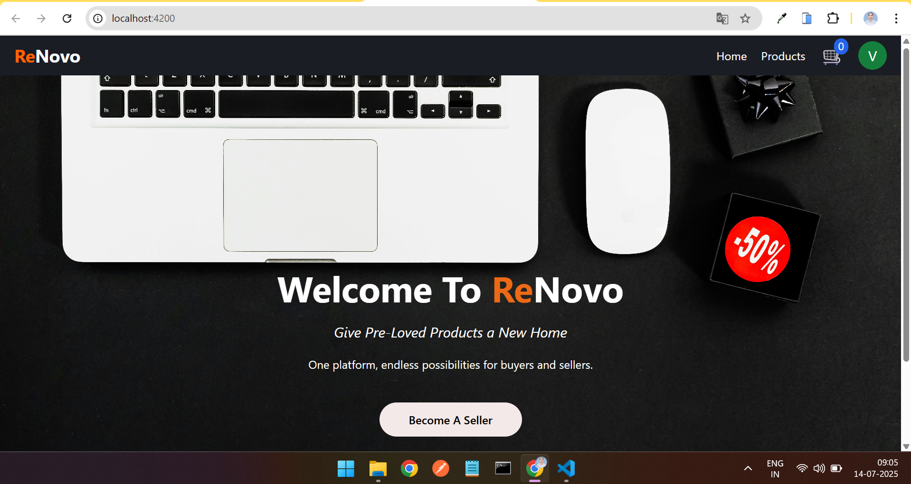
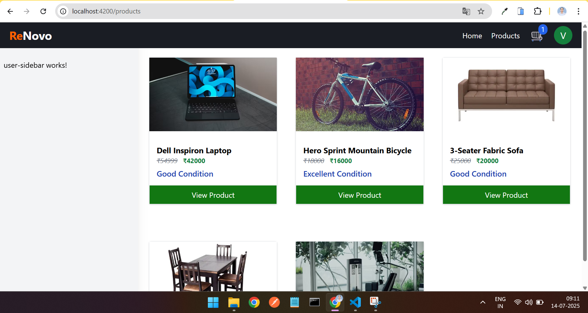
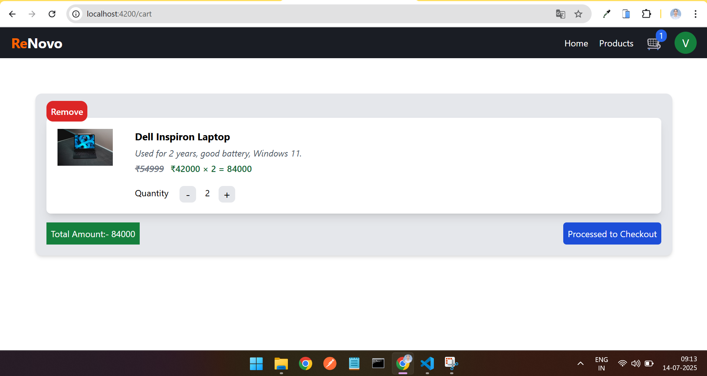
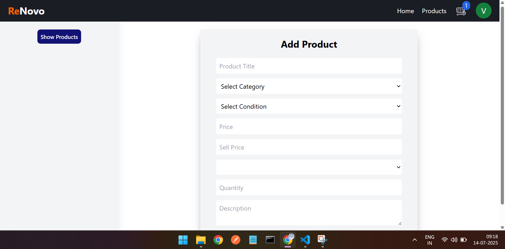
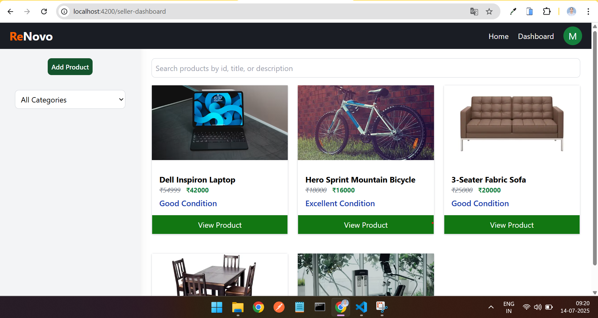
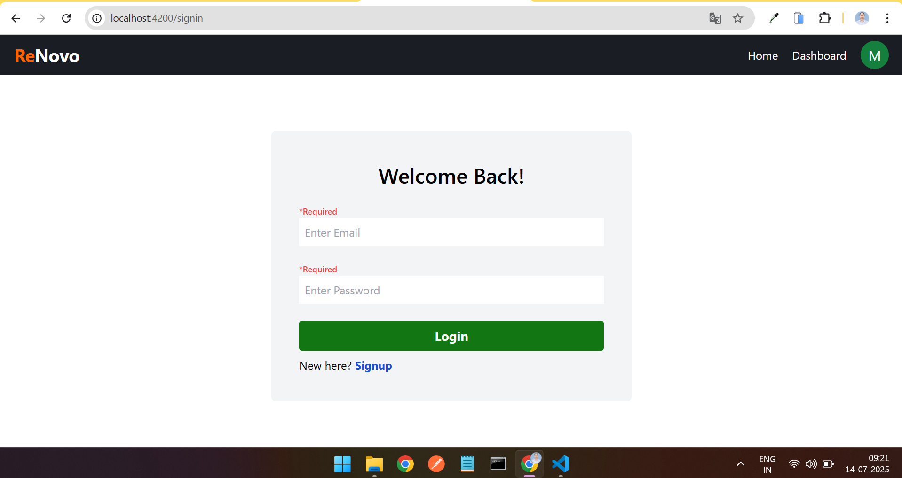
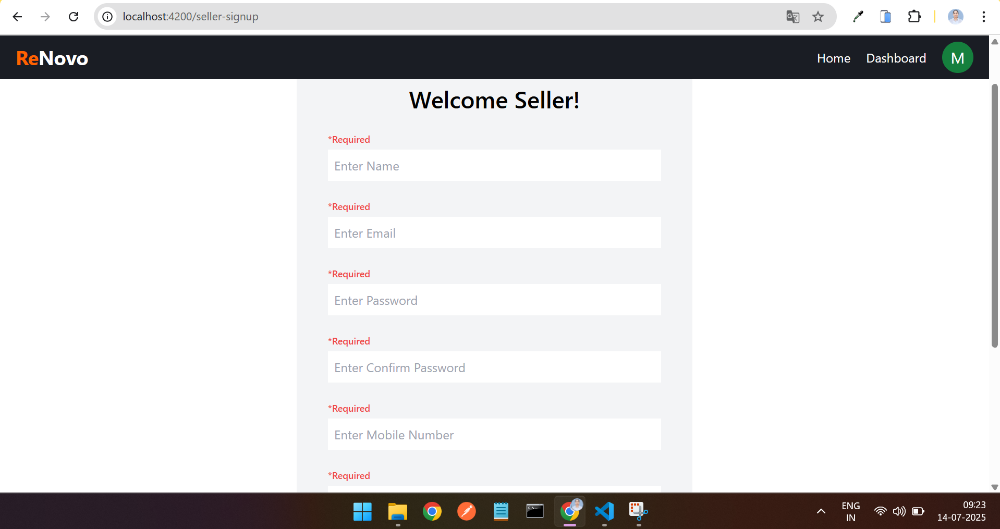

# ReNovo – Second-Hand Product Selling Website
ReNovo is a user-friendly web application for buying and selling second-hand products. The platform connects sellers looking to sell used items with buyers searching for affordable and quality second-hand goods.

## 🌐 Tech Stack

- **Frontend:** Angular, CSS, TypeScript
- **Backend:** Spring Boot (Java)
- **Database:** SQL 

## SnapShots
;
;
;
;
;
;
;

---

## 🚀 Features

- 🛒 **Browse Products** by category, title, or condition
- 🧾 **Add Products** as a seller with detailed descriptions and pricing
- 🧍‍♂️ **User Authentication** for secure login and signup
- ❤️ **Add to Cart** feature for buyers
- 📦 **Order Management**
- 📃 **Admin Panel** (optional extension)

---

## 🛠️ How to Run Locally

### Prerequisites

Make sure you have the following installed:

- **Node.js** and **npm**
- **Angular CLI**
- **Java JDK (17+)**
- **Maven** (for Spring Boot)
- **MySQL** or your preferred SQL database

---

### 🔧 Backend Setup (Spring Boot)

1. **Clone the repository:**
   ```bash
   git clone https://github.com/VaishnaviDhobale/FinalProjectRenovo/tree/master/ReNovo
   cd renovo
